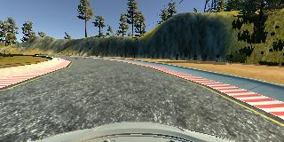
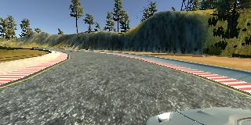
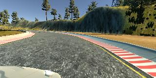

# Behavior Cloning
## Behavior Cloning Project Goals
* Collect driving data from a Udacity simulator
* Build a Convolutional Neural Network (CNN) with Keras
* Train the model to predict steering angles from images
* Test the model in the simulator

## Rubric Points 
### Here I will consider the [rubric points](https://review.udacity.com/#!/rubrics/432/view) individually and describe how I addressed each point in my implementation. 
----------------------------------------------------------------------------
### Files Submitted & Code Quality
#### 1. Submission includes required files and can be used to run the simulator in autonomous mode

My project includes the following files:
* model.py - to create and train the model
* drive.py - for driving the car in autonomous mode
* model.h5 & model.json - containing a trained CNN
* writeup\_report.md - summarizing the results

#### 2. Submission includes functional code

Using the Udacity provided simulator and my drive.py file, the car can be driven autonomously around the track by executing:

```
python drive.py model.json
```
#### 3. Submission code is usable and readable

The model.py file contains the code for training and saving the convolution neural network. The file shows the pipeline I used for training and validating the model, and it contains comments to explain how the code works.

### Model Architecture and Training Strategy
#### 1. An appropriate model architecture has been employed

The [model](https://github.com/CassLamendola/behavior-cloning/blob/master/model.py#L66-L82) consists of a CNN with 5 convolutional layers, 3 hidden fully connected layers, and a final output layer. The first 3 convolutional layers use 5x5 filter size and a stride of 2. The 4th and 5th convolutional layers use 3x3 filters and a stride of 1. The depths of the convolutions range from 24 to 64.

The model includes ReLu layers to introduce nonlinearity and the data is normalized in the model using [Keras Lambda layer](https://github.com/CassLamendola/behavior-cloning/blob/master/model.py#L258). 

#### 2. Attempts to reduce overfitting in the model

The model contains a [dropout layer](https://github.com/CassLamendola/behavior-cloning/blob/master/model.py#L292) on the last convolutional layer to reduce overfitting.

#### 3. Model parameter tuning

The model used an Adam optimizer with a [learning rate](https://github.com/CassLamendola/behavior-cloning/blob/master/model.py#L94-L99) of 0.001 for training and 0.00001 for fine-tuning the model.

#### 4. Appropriate training data

Training data was chosen to keep the vehicle on the road. A combination of driving in the center of the lane and recovering from the left and right sides of the road was used. Here are some examples of images taken with the center, left, and right cameras during data collection:





### Architecture and Training Documentation
#### 1. Solution design approach

The overall strategy for the model architecture was to start with a simple CNN with a few layers and add complexity as needed to improve accuracy and decrease loss. Initially, the model had 3 convolutional layers with a stride of 1 and max pooling after each layer.

In order to determine how well the model was working, I split my image and steering angle data into a training and validation set. I found that both were very low and often wouldn't improve at all after the first epoch. The best accuracy achieved with this model was less than 50%. I believe this also may have impacted the effectiveness of the Adam optimizer.

Eventually, the model was changed to resemble the NVIDIA architecture as described in [this](https://images.nvidia.com/content/tegra/automotive/images/2016/solutions/pdf/end-to-end-dl-using-px.pdf) paper. I thought this model would be appropriate because it was created to do the same task. At first, only the number of layers was adjusted. I only changed one part of the architecture at a time to see what would improve the model. Later, the max pooling was omitted and the convolutions instead used a stride of 2 to reduce size. Eventually, I ended up with a model that was identical to the NVIDIA model.

To combat overfitting, I added dropout on the last convolutional layer.

The final step was to run the simulator to see how well the car was driving around track one.

#### 2. Final model architecture

The [final model architecture](https://github.com/CassLamendola/behavior-cloning/blob/master/model.py#L255-L310) consists of a convolutional neural network with the following layers and layer sizes:

* Convolutional Layer 1 -> (66 x 200 x 3) -> (31 x 98 x 24)
* Convolutional Layer 2 -> (31 x 98 x 6) -> (14 x 47 x 36)
* Convolutional Layer 3 -> (14 x 47 x 12) -> (5 x 22 x 48)
* Convolutional Layer 4 -> (5 x 22 x 24) -> (3 x 20 x 64)
* Convolutional Layer 5 -> (3 x 20 x 36) -> (1 x 18 x 64)
* Fully Connected Layer 1 -> 1 x 18 x 64 = 1152 -> 100
* Fully Connected Layer 2 -> 100 -> 50
* Fully Connected Layer 3 -> 50 -> 10
* Output Layer -> 10 -> 1

Each layer (other than the output layer) is followed by ReLu activation.

#### 3. Creation of the training set & training process

##### Data Generation

To capture good driving behavior, I first recorded 2 or 3 laps around the track. I then augmented the data by flipping images (multiplying the steering angle by -1) and using the left and right camera images (adding or subtracting 0.08 from the steering angle). 

Next, I preprocessed the images. First, I cropped the images to 66x200, cutting out the sky and hood of the vehicle, to match the input size given in the NVIDIA paper. Then executed Gaussian blur on the images.

##### Training

The first few times, the steering angle didn't change and the vehicle drove right off the road. At this point, more data was collected (about 30,000 frames) and the model began to predict different angles. There were a few spots where the vehicle fell off the track. To improve the driving behavior in these cases, I collected even more 'recovery' data.

I placed the car near the edge of the lane and recorded the car driving back to center. At some places I simply recorded the car sitting still with the wheel turned all the way to one side for a few frames. With this much data, I was having mixed results.

After that, every model I trained came so close to finishing the track, but crossed the line in one or two places. At this point I decided to implement fine-tuning. [This](https://blog.keras.io/building-powerful-image-classification-models-using-very-little-data.html) was a helpful resource. I collected data at the point of the track where the vehicle was crossing the line and fine-tuned on that data. Additionally, I tried freezing model layers for fine-tuning as described in the Keras blog listed above, but I saw poor results. The model swerved back and forth across the track, crashing almost immediately. Other times, the vehicle would complete the "problem" region of the track, but crash elsewhere. 

The model seemed to be overfitting to the fine-tuning data. To combat this, I added the fine-tuning data to the original dataset and retrained from scratch. This didn't have much of an effect on the performance of the model, and it also resulted in very random results from one training to the next. 

At this point, the unpredictability of the models led me to research the Keras checkpoint callbacks. The checkpoint callback generates a new set of weights after each epoch, which allowed me to select the best set of weights from a training run. It seemed probable that my data was partly to blame for the bad performance, as I had collected so much specific recovery data, so I decided to start fresh with new data. Eventually, I settled on a very methodical approach, described as follows:

1. Generate training data consisting of 6 times around the track, driving in the center of the lane (3 times clockwise, and 3 times counterclockwise)
2. Train the model for 5 epochs with a fairly high learning rate of 0.001
3. Test the weights from each epoch in the simulator to select the best one. Repeat step 2 until a set of weights allows the car to drive around the track with minor errors
4. Generate new training data that consists only of recovery data from the parts of the track where the model had issues
5. Fine-tune the model with a learning rate one order of magnitude lower than before for twice as many epochs (lr = 0.0001 for 10 epochs, lr = 0.00001 for 20 epochs and so on)
6. Test the weights as in step 3 to find improvements. (In some cases, the improvements were so slight that I recorded the steering angle with my cell phone to determine whether or not the model had improved. The difference was sometimes as slight as 2.5 vs 2.4)
7. Repeat steps 4, 5, and 6 until a working model is created

On the final round of fine-tuning which produced a working model, the learning rate was set at 0.000001 and trained for 40 epochs. Finally, the vehicle was able to drive autonomously around the track without leaving the road or crossing any lines.

For augmentation during fine-tuning, I didn't include every side camera image or flipped image. I implemented a [function](https://github.com/CassLamendola/behavior-cloning/blob/master/model.py#L248-L249) to only use only a certain percent of side images and flipped images. After the collection and augmentation processes, I had over 60,000 data points to train on.

The data was split into 80% training and 20% validation. The validation set helped determine if the model was over or under fitting. The ideal number of epochs was between 3 and 10 for training and no more than 30 for fine-tuning. I also implemented [early stopping](https://github.com/CassLamendola/behavior-cloning/blob/master/model.py#L64) if the loss did not improve for more than 3 epochs.

[Here](https://vimeo.com/205326783) is the link to the video of my final model.
